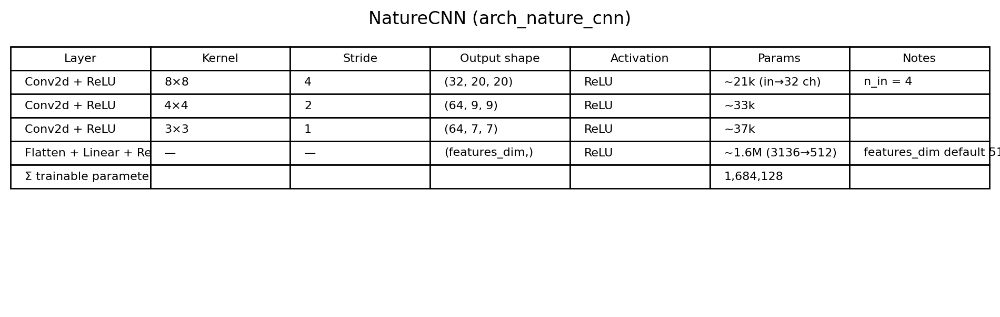
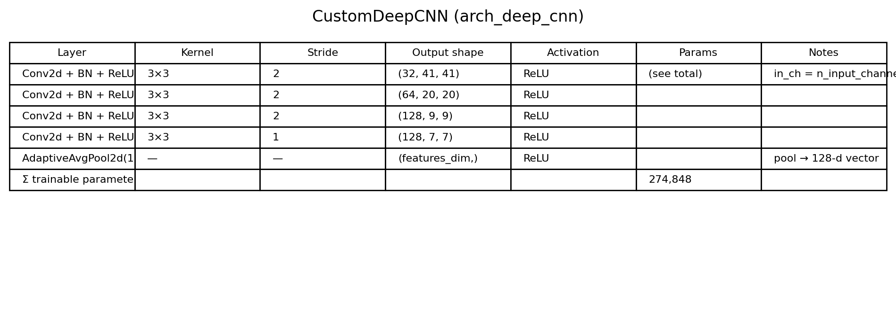
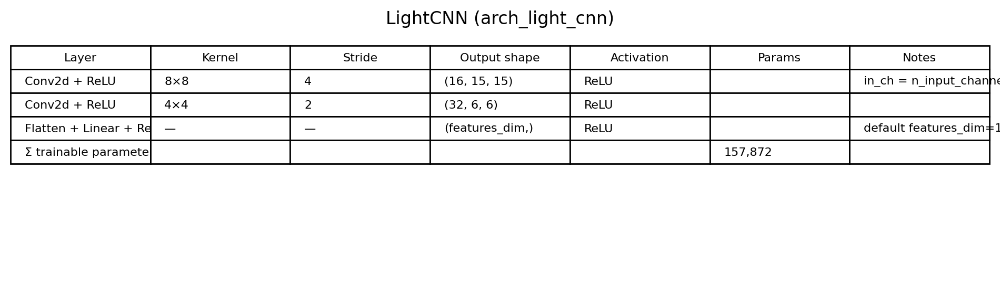
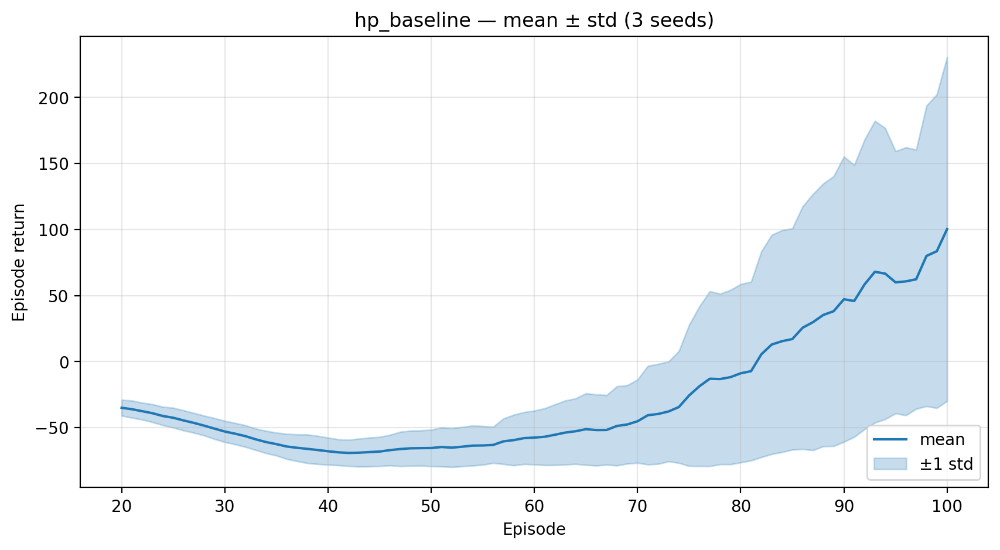
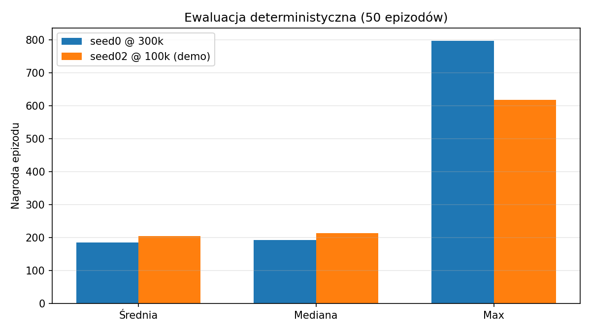
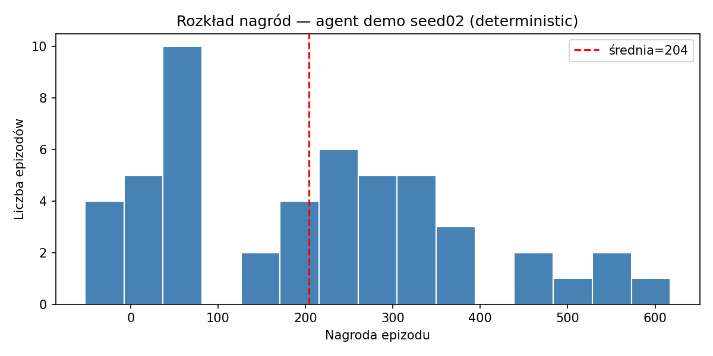
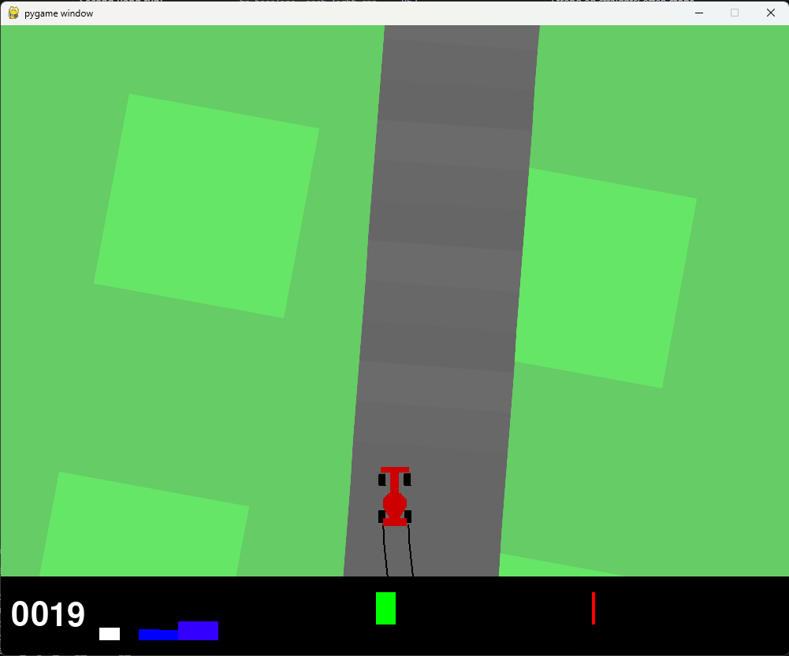
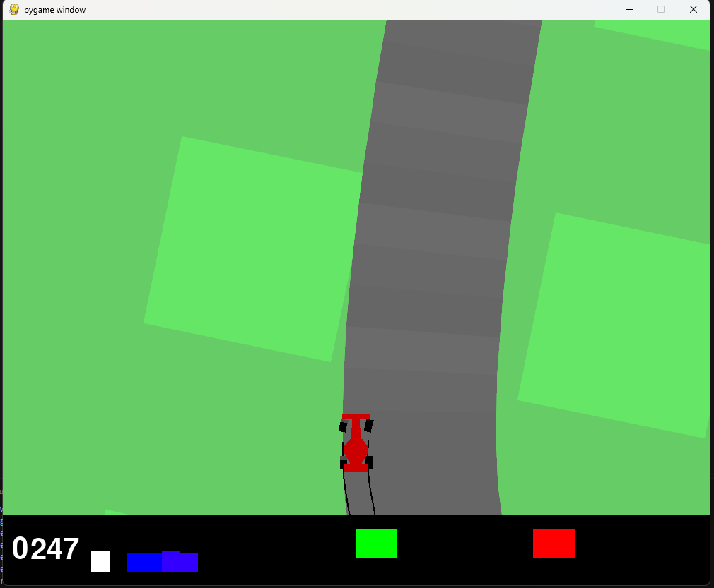
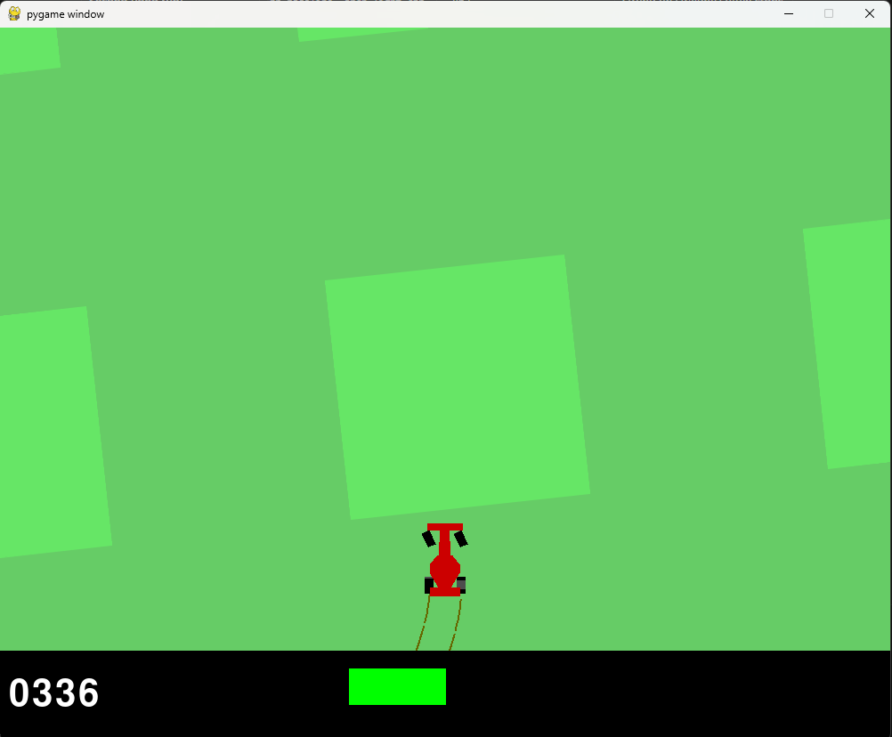

# Project — Reinforcement Learning in Continuous Spaces

## Autonomous Racing Agent (SAC + CarRacing-v3)

**Course:** Computational Intelligence  
**Topic:** Reinforcement learning in continuous action and observation spaces  

---

## 1. Project Goal

The goal was to implement and train a reinforcement-learning agent in a **continuous** action space with **visual** (image) observations, and to produce a report covering: environment and algorithm description, hyperparameter comparison, CNN architecture comparison, training-time measurement, and deterministic evaluation of the best agent.

This project continues earlier work in **discrete spaces** ([crossy-road-gymnasium](https://github.com/xhamera1/crossy-road-gymnasium), PPO). Here we use an **off-policy** algorithm (SAC) and **CnnPolicy** because observations are pixel-based.

---

## 2. Environment: `CarRacing-v3`

### 2.1 Description

`CarRacing-v3` (Gymnasium / Box2D) is a classic top-down racing environment. The track is **randomized every episode**, which forces generalization rather than memorizing a single layout.

**Observation space:** `Box(0, 255, (96, 96, 3), uint8)` — RGB image 96×96 px.

**Action space (continuous):** `Box([-1, 0, 0], [1, 1, 1], (3,), float32)`:

- axis 0 — steering (−1 = max left, +1 = max right),
- axis 1 — gas,
- axis 2 — brake.

**Reward function:** each step gives about **−0.1** (time penalty) plus a positive term for **newly visited track tiles**; revisiting the same tiles incurs a strong penalty. The reward is dense but requires staying on track and handling curves.

**Episode termination:** lap completion or **1000 step** limit.

### 2.2 Observation Preprocessing (Implementation)

In the repository (`src/racing_agent/env/wrappers.py`, `make_env.py`) we apply, in order:

1. **Grayscale** — `(96, 96, 3) → (96, 96)`.
2. **Resize** — default 84×84 (local) or **64×64** (Kaggle profile).
3. **Frame stack** — default 4 frames (local) or **2 frames** (Kaggle profile used in training).
4. Optional **ClipReward** (disabled in our runs).

Output to `CnnPolicy` is **C×H×W** (uint8), per SB3 convention.

### 2.3 Step and Episode Timing

From runs @ 100,000 steps (GPU T4, Kaggle, `arch_light_cnn`):


| Metric                       | Value                                                           |
| ---------------------------- | --------------------------------------------------------------- |
| Mean step time               | **~0.025 s**                                                    |
| Mean episode time            | **~1263 s** (~21 min) — training episodes logged by SB3 Monitor |
| Mean wall-clock / 100k steps | **~2529 s** (~42 min)                                           |


*Note:* Monitor episode time includes full training interactions (including SAC updates), so it is longer than rollout-only preview.

---

## 3. Algorithm: Soft Actor-Critic (SAC)

### 3.1 Description

**Soft Actor-Critic (SAC)** is an **off-policy** algorithm for continuous actions, combining:

- **actor-critic** with Q-function (in SAC: **two** Q networks — double Q, reduced overestimation),
- **entropy maximization** — policy maximizes reward while maintaining exploration (temperature **α**),
- **experience replay buffer** — sample reuse, important for expensive visual observations.

In **Stable-Baselines3** we use class `SAC` with `**CnnPolicy`**: a separate CNN feature extractor (NatureCNN / CustomDeepCNN / LightCNN) plus actor and critic MLP heads.

Key SB3 configuration in this project:

- `ent_coef="auto"` — automatic temperature tuning,
- `train_freq`, `gradient_steps`, `batch_size`, `tau` — learning pace and stability,
- `**best_model.zip`** saved via eval callback (`EvalSaveBestCallback`).

#### How It Works — Driver Analogy

The whole agent can be viewed as an **autonomous driver** built from several neural networks:


| Analogy role   | SAC component                | What it does                                                                                           |
| -------------- | ---------------------------- | ------------------------------------------------------------------------------------------------------ |
| **Eyes**       | **CNN** (e.g. LightCNN)      | Reads game frames (track + car), extracts a feature vector — e.g. 128 numbers describing the situation |
| **Decision**   | **Actor** (MLP)              | Chooses action from features: steering, gas, brake (3 continuous values)                               |
| **Evaluation** | **Critic** (2× MLP, Q1 & Q2) | Scores *(state, action)*: “will this decision pay off long-term?”                                      |
| **Trainer**    | **SAC algorithm**            | Compares decisions with environment rewards and updates CNN, actor, and critic weights                 |


**Data flow during training:**

1. `CarRacing-v3` returns an **image** (after preprocessing: grayscale, resize, frame stack).
2. **CNN** converts the image to a **feature vector**.
3. **Actor** picks an action and sends it to the simulator.
4. The game returns **reward** (e.g. −0.1 time penalty, bonus for new track) and the **next image**.
5. Tuple *(image, action, reward, next image)* goes into the **replay buffer**.
6. SAC samples a batch and updates all network weights (backprop).

**Important:** rewards and penalties are **not inside the network** — the game simulator provides them. Networks use them only as a learning signal. During preview (`watch_agent.py`) only **image → CNN → actor → action** runs; the critic does not drive the car.

“Soft” in the name means **entropy maximization**: besides high reward, SAC also rewards some action randomness so the agent does not get stuck in one bad strategy. Parameter **α** (`ent_coef="auto"` in SB3) balances reward vs exploration.

### 3.2 Why SAC, Not PPO?

In Project 4 (Crossy Road) we used **PPO** (on-policy) on vector observations. Here the observation is an **image** and rollouts are expensive — SAC with replay buffer reuses collected data more efficiently. Continuous actions (steer + gas + brake) are a natural fit for SAC in SB3.

---

## 4. Repository Layout


| Module          | Path                                       | Role                                            |
| --------------- | ------------------------------------------ | ----------------------------------------------- |
| Env factory     | `src/racing_agent/env/make_env.py`         | `make_car_racing()`, `make_car_racing_single()` |
| Visual wrappers | `src/racing_agent/env/wrappers.py`         | grayscale, resize, frame stack                  |
| CNN policies    | `src/racing_agent/policies/`               | `NatureCNN`, `CustomDeepCNN`, `LightCNN`        |
| Training        | `src/racing_agent/training/train.py`       | `Trainer` class, SAC, callbacks                 |
| Hyperparameters | `configs/hp_*.yaml`, `configs/arch_*.yaml` | YAML → merge → SAC                              |
| Experiments     | `scripts/run_experiment.py`                | HP grid × seeds                                 |
| Learning curves | `scripts/plot_curves.py`                   | mean ± std, `timing_table.csv`                  |
| Live preview    | `scripts/watch_agent.py`                   | pygame, `render_mode="human"`                   |
| Evaluation      | `scripts/evaluate.py`                      | 50 episodes, `deterministic=True`               |


Each run saves metadata in `experiments/<run_id>/run_metadata.json`, Monitor logs in `logs/monitor/`, models in `models/best/` and `models/final/`.

Production training ran on **Kaggle (GPU T4)** with notebook `notebooks/02_kaggle_hp_sweep.ipynb`; results were imported locally.

---

## 5. Hyperparameter Sets

Per assignment requirements we defined **three** HP sets (`configs/`). Kaggle training actually used `**hp_baseline`**; the other two are ready in the repo for grid runs (`run_experiment.py`).

### 5.1 SAC Hyperparameter Table


| Parameter         | `hp_baseline` | `hp_high_lr` | `hp_large_batch` |
| ----------------- | ------------- | ------------ | ---------------- |
| `learning_rate`   | 3×10⁻⁴        | **1×10⁻³**   | 3×10⁻⁴           |
| `buffer_size`     | 100,000       | 100,000      | **300,000**      |
| `batch_size`      | 256           | 256          | **512**          |
| `tau`             | 0.005         | **0.02**     | 0.005            |
| `train_freq`      | 1             | 1            | **4**            |
| `gradient_steps`  | 1             | 1            | **4**            |
| `learning_starts` | 1000          | 1000         | 2000             |
| `gamma`           | 0.99          | 0.99         | 0.99             |
| `ent_coef`        | auto          | auto         | auto             |


**Hypotheses:**

- *baseline* — reference point (SB3 defaults),
- *high_lr* — faster learning, risk of instability,
- *large_batch* — smoother gradients, higher wall-clock cost.

### 5.2 Kaggle Profile (`kaggle_overrides.yaml`)

Due to GPU time limits we applied an additional overrides file:


| Parameter              | Training value | Purpose                         |
| ---------------------- | -------------- | ------------------------------- |
| `resize_to`            | 64             | fewer pixels → faster steps     |
| `frame_stack`          | **2**          | smaller CNN input               |
| `buffer_size`          | 50,000         | faster learning start           |
| `learning_starts`      | 500            | earlier updates                 |
| `eval_every_timesteps` | 50,000         | save `best_model` at end of run |


Training architecture: `**arch_light_cnn`** (smaller network than NatureCNN).

---

## 6. Neural Network Architectures

The assignment requires at least **two** CNN architectures. We implemented three feature extractors; **completed experiments** used **LightCNN**. **NatureCNN** and **CustomDeepCNN** are fully implemented for comparison (Phase 5); a short NatureCNN smoke test (5000 steps) was run locally.

### 6.1 Architecture A — NatureCNN (SB3 default)

- **Input:** `(4, 84, 84)` float32 (after /255 normalization),
- **Conv** 32×8, stride 4 → ReLU → Conv 64×4, s=2 → ReLU → Conv 64×3, s=1 → ReLU,
- **Flatten** → **Linear → 512** (features_dim),
- **SAC heads:** MLP `[256, 256]` (actor and critics).

Files: `configs/arch_nature_cnn.yaml`, `src/racing_agent/policies/nature_cnn.py`.



### 6.2 Architecture B — CustomDeepCNN

- **Input:** `(4, 84, 84)`,
- **Conv** 32×3, s=2 → BatchNorm → ReLU → (repeated layers 64, 128, 128),
- **AdaptiveAvgPool2d(1)** → **Linear → 256**,
- **SAC heads:** MLP `[256, 256]` (same as A — fair comparison).

Files: `configs/arch_deep_cnn.yaml`, `src/racing_agent/policies/custom_cnn.py`.



### 6.3 Architecture C — LightCNN (Kaggle training)

- **Input:** `(2, 64, 64)` with Kaggle overrides,
- **Conv** 16×8, s=4 → ReLU → Conv 32×4, s=2 → ReLU,
- **Flatten** → **Linear → 128**,
- **SAC heads:** MLP `[128]`.

File: `configs/arch_light_cnn.yaml` — about **5–10× fewer** conv params than NatureCNN, ~42 min / 100k steps on T4.



**Why LightCNN for training:** a full 3×10×50k grid on NatureCNN would exceed the Kaggle budget (~30 h GPU/week); LightCNN enabled iteration and refinement of import, preview, and evaluation pipelines.

---

## 7. Experiment Timeline and Training Stages

Chronology of **completed** runs (`hp_baseline`, `arch_light_cnn`, Kaggle overrides, stack=2, 64×64):


| Stage                 | Run (suffix)         | Seed | Steps       | Peak reward (Monitor) | Observation                                                     |
| --------------------- | -------------------- | ---- | ----------- | --------------------- | --------------------------------------------------------------- |
| 1 — Kaggle smoke      | `…193403`            | 0    | 20,000      | −20                   | Near-random agent; spinning / no driving                        |
| 1 — Kaggle smoke      | `…194312`, `…195214` | 1, 2 | 20,000      | −17, 0.4              | No sensible driving                                             |
| 2 — longer run        | `…205005`            | 0    | 100,000     | 288                   | First positive episodes; unstable                               |
| 3 — long run          | `…214604`            | 0    | **300,000** | **863**               | Highest training peak; late training worse (negative tail mean) |
| 4 — sweep (session 1) | `…061846`            | 0    | 100,000     | 288                   | Repeat seed0 @ 100k (newer timestamp)                           |
| 4 — sweep (session 1) | `…070055`            | 1    | 100,000     | 58                    | Weak run — no stable driving                                    |
| 4 — sweep (session 1) | `…074316`            | 2    | 100,000     | **774**               | **Best run for live preview driving**                           |


### 7.1 Iterative Improvements

1. **More training steps** (20k → 100k → 300k) — key fix; at 20k the agent could not learn the track.
2. **Checkpoint selection** — `best_model` vs `final_model`; auto-pick by Monitor peak vs live driving quality.
3. **Deterministic evaluation** — 50 headless episodes (`evaluate.py`).

---

## 8. Quantitative Results

### 8.1 Learning Curve

Learning curve for `**hp_baseline`**, architecture `arch_light_cnn`, **3 seeds @ 100,000 steps** (mean ± std):



Large spread between seeds (seed1 weak, seed2 strong) confirms high SAC variance on CarRacing with limited steps. Clear improvement vs early 20k runs (negative rewards) — effect of increased step budget described in section 7.

### 8.2 Training Time

File: `reports/figures/timing_table.csv`


| HP          | Runs | Mean wall-clock [s] | Mean step time [s] | Steps   |
| ----------- | ---- | ------------------- | ------------------ | ------- |
| hp_baseline | 3    | 2529                | 0.025              | 100,000 |


### 8.3 Deterministic Evaluation

**Evaluation** tests a trained agent: load checkpoint (`best_model.zip`), run **50 episodes** **without further learning**, collect reward statistics (mean, median, min, max). Script: `scripts/evaluate.py`.

#### Deterministic vs Stochastic Mode

In SAC the **actor** returns an **action distribution** per step — e.g. “steer about −0.4 with some spread”. This applies to steering, gas, and brake.


| Mode              | Parameter             | Agent behaviour                                                                      |
| ----------------- | --------------------- | ------------------------------------------------------------------------------------ |
| **Deterministic** | `deterministic=True`  | Always picks **distribution mean** — same “best guess” action for the same image     |
| **Stochastic**    | `deterministic=False` | **Samples** from the distribution — same corner may yield slightly different actions |


**Example (steering):** network suggests left turn about **−0.4**. Deterministic mode always sends −0.4; stochastic may send −0.38, −0.52, or −0.31.

We use `**deterministic=True`** to measure **stable policy quality**, not random exploration noise from training.

---

#### Comparison agent — seed0 @ 300k

**Model:** `hp_baseline__arch_light_cnn__seed00__20260518-214604` / `best_model.zip`  
**File:** `reports/figures/eval_summary.json`  
**Settings:** 50 episodes, `deterministic=True`.


| Statistic   | Value     |
| ----------- | --------- |
| Mean reward | **185.1** |
| Median      | **191.6** |
| Std. dev.   | **174.5** |
| Min         | −40.4     |
| Max         | **795.8** |


#### Demo agent — seed02 @ 100k (better in preview)

**Model:** `hp_baseline__arch_light_cnn__seed02__20260519-074316` / `best_model.zip`  
**File:** `reports/figures/eval_summary_seed02.json`  
**Settings:** 50 episodes, `deterministic=True`.


| Statistic   | Value     |
| ----------- | --------- |
| Mean reward | **203.8** |
| Median      | **213.7** |
| Std. dev.   | **170.9** |
| Min         | −52.4     |
| Max         | **617.5** |


All evaluation episodes hit **1000 steps** (timeout). seed02 has **higher mean and median** than seed0 @ 300k, confirming seed02 as demo agent despite lower training peak (774 vs 863).

**Both agents compared (deterministic eval, 50 episodes):**



**Reward distribution — demo agent seed02:**



High standard deviation (~171) indicates large episode variability — some runs end poorly (negative reward), others very well (600+ pts).

### 8.4 Two Demo Agents Compared (Live Preview)


| Agent                    | Folder                     | Training peak | `watch_agent` behaviour                                                      |
| ------------------------ | -------------------------- | ------------- | ---------------------------------------------------------------------------- |
| **Primary (better)**     | `…seed02__20260519-074316` | 774           | Better on straights; on sharp turns **drives straight off the map**          |
| **Secondary (long run)** | `…seed00__20260518-214604` | 863           | OK on straights; on turns **brakes and stops** until episode end (−0.1/step) |


Sample preview logs (`--fast`):

- **seed0 @ 300k:** ep.2 — reward 347.8 @ step 400, then ~20 drop every 200 steps (standing still).
- **seed02 @ 100k:** ep.2 — reward **389.5** @ step 400 (clearly better driving segment).

**Qualitative conclusion:** neither model mastered sharp turns — different failure modes: stop vs fly off track. We chose seed02 as **demo agent** for better driving segments in preview despite slightly lower training peak than seed0 @ 300k.

---

## 9. Race Screenshots

Frames from live preview (`scripts/watch_agent.py`, demo agent **seed02 @ 100k**, `deterministic=True`). Typical behaviour: good driving on straights, failure on sharp turns.

### 9.1 Good Driving — Straight Section



*Fig. 9.1 — Car drives down the centre of the track; tire marks visible. Agent maintains direction and collects progress reward.*

### 9.2 Entering a Turn



*Fig. 9.2 — Car turning on a curve.*

### 9.3 Failure — Off Track



*Fig. 9.3 — Car fully left the asphalt. Episode effectively lost: no reward on grass, agent does not return to track.*

### 9.4 Why the Model Is Not “Best”

The current checkpoint **does not represent full SAC potential on CarRacing** — mainly due to **limited training budget** (100,000 steps on Kaggle T4, LightCNN 64×64, stack=2) and no time for full HP grid and architecture comparison. Literature and typical benchmarks require **millions of steps** and larger networks.

**Why does it fly off on sharp turns and not recover?**

1. **Under-trained on hard manoeuvres** — at 100k steps the agent mostly saw straights and gentle curves; sharp turns need simultaneous braking, steering, and line control — the network has not learned that synergy.
2. **Too much speed into corners** — policy often keeps gas; works on straights, inertia pushes the car off on tight turns.
3. **No reward off track** — on grass reward drops; the image (green background without clear track edge) **does not resemble training states**, so the actor has no “map back”.
4. **Deterministic policy** — in preview the agent does not explore; repeats the same (wrong) actions instead of searching for the track.

Consistent with section 8.4: seed02 drives better than seed0 on straights, but **both models failed sharp turns** — only the failure mode differs (fly off vs stop).

---

## 10. 8-Point Task — Summary


| Element                     | Implementation                                                           |
| --------------------------- | ------------------------------------------------------------------------ |
| Save best agent             | `experiments/…/models/best/best_model.zip`                               |
| Deterministic simulation    | `scripts/evaluate.py --deterministic`                                    |
| Compare with learning curve | training peak (863) vs eval mean (185) — see section 8.1 and chart above |
| Visual preview              | `scripts/watch_agent.py` (pygame)                                        |


---

## 11. Final Conclusions

1. **SAC + CnnPolicy** on `CarRacing-v3` is feasible but requires **many steps** (≥100k) and a stable training setup.
2. **Kaggle profile (LightCNN, 64×64, stack=2)** enabled iteration in reasonable time (~42 min / 100k on T4).
3. **Best demo agent:** `hp_baseline`, seed **2**, 100k steps — sensible driving on straights, problems on sharp turns.
4. **Comparison agent:** seed **0**, 300k — highest training peak (863), worse deterministic behaviour on turns (stop).
5. **Hyperparameters and architectures B/C** — defined and implemented; full experiment grid not completed due to compute limits (documented per assignment requirements).

---

## 12. Setup and Running

**Python:** 3.10 – 3.12 (**use 3.12** in `.venv`; system 3.14 has no Box2D)

```bash
# environment
py -3.12 -m venv .venv
.\.venv\Scripts\Activate.ps1          # PowerShell
# source .venv/Scripts/activate       # Git Bash
pip install -e ".[dev]"
python -c "import sys; print(sys.executable)"   # must show .venv
```

Always run from repo root with **activated `.venv`**.

### Best agent (seed02 @ 100k) — recommended

```bash
python scripts/watch_agent.py \
  --run-dir experiments/hp_baseline__arch_light_cnn__seed02__20260519-074316 \
  --fast --episodes 5
```

Loop until Ctrl+C:

```bash
python scripts/watch_agent.py \
  --run-dir experiments/hp_baseline__arch_light_cnn__seed02__20260519-074316 \
  --loop
```

Headless stats:

```bash
python scripts/evaluate.py \
  --run-dir experiments/hp_baseline__arch_light_cnn__seed02__20260519-074316 \
  --episodes 50 --deterministic
```

### Comparison agent (seed0 @ 300k)

```bash
python scripts/watch_agent.py \
  --run-dir experiments/hp_baseline__arch_light_cnn__seed00__20260518-214604 \
  --fast --episodes 5
```

```bash
python scripts/evaluate.py \
  --run-dir experiments/hp_baseline__arch_light_cnn__seed00__20260518-214604 \
  --episodes 50 --deterministic
```

**Tips:** Reward lines appear **after each episode** (~1000 steps). `--fast` skips real-time delay. Close pygame or Ctrl+C to stop.

**Do not use** `--arch arch_light_cnn` alone — auto-pick favours seed0 @ 300k (highest training peak), not seed02 (better driving).

### Import more Kaggle runs (optional)

```bash
python scripts/import_kaggle_outputs.py --zip ~/Downloads/kaggle_outputs.zip
python scripts/plot_curves.py --arch arch_light_cnn --min-timesteps 100000
python scripts/generate_report_figures.py
```

### Other commands


| Goal             | Command                                                                      |
| ---------------- | ---------------------------------------------------------------------------- |
| Tests            | `pytest tests/`                                                              |
| Plot curves      | `python scripts/plot_curves.py --arch arch_light_cnn --min-timesteps 100000` |
| MD → HTML report | `python scripts/md_to_html.py`                                               |


